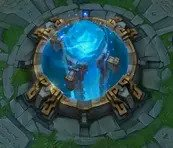
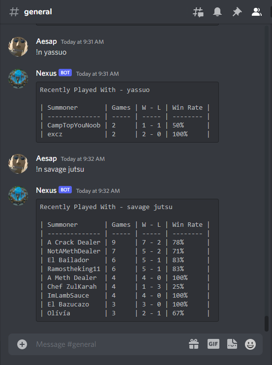

<!-- PROJECT SHIELDS -->
<!--
*** I'm using markdown "reference style" links for readability.
*** Reference links are enclosed in brackets [ ] instead of parentheses ( ).
*** See the bottom of this document for the declaration of the reference variables
*** for contributors-url, forks-url, etc. This is an optional, concise syntax you may use.
*** https://www.markdownguide.org/basic-syntax/#reference-style-links
-->

<!-- PROJECT LOGO -->

  

  <h1>Nexus Bot </h1>

   
   

  

  A discord bot for League of Legends stats with friends.
   

  

  

<!-- ABOUT THE PROJECT -->
## About The Project

 

## Built With
* [Node.js](https://nodejs.org/)
* [Raspberry Pi OS (Debian Linux)](https://jquery.com/) - optional

## Install
* git clone
* npm install
* create discord bot and get token
* create env with token
* host on server or raspberry pi

<!-- LICENSE -->
## License

Distributed under the MIT License.

(<a href="#top">back to top</a>)

<!-- CONTACT -->
## Contact

Jesus Yanez - jesusy5133@hotmail.com

Project Link: [https://github.com/jesusyanez/Nexus-Bot](https://github.com/jesusyanez/Nexus-Bot)

(<a href="#top">back to top</a>)

<!-- ACKNOWLEDGMENTS -->
## Shout Outs

* [Discord.js](https://discord.js.org/#/)

(<a href="#top">back to top</a>)

